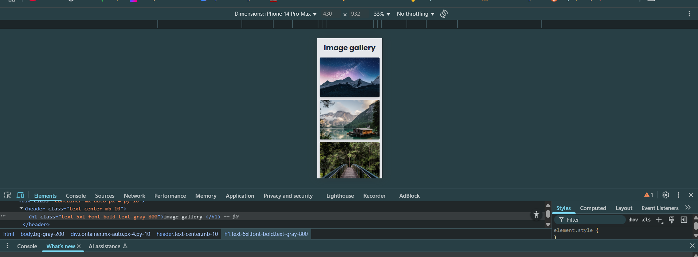

# Image Gallery Task
**Desktop View**

**Mobile View**

**Tablet View**

## Features

- Responsive grid:- 1 column on mobile, 3 on tablet, 4–6 on desktop
- Fullscreen lightbox viewer with descriptive captions
- Images loaded dynamically from a JavaScript array for easy updates
- Modern styling using Tailwind CSS

## How to Run

1. Clone or download this repository  
2. Open the `gallery.html` file in any modern web browser  
3. No installation needed

## Credits

- Images from Unsplash  
- Built with Tailwind CSS  

